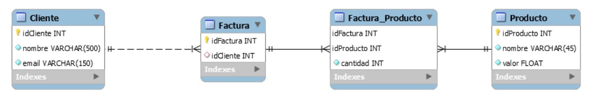

# 📚 Ejercicio Integrador - JDBC

## Descripción

Este proyecto consiste en la implementación de un programa en **Java utilizando JDBC**.

El sistema permite crear el esquema de la base de datos, la carga de información desde archivos CSV y la realización de consultas SQL mediante JDBC.

## 📊 Diagrama
### Diagrama Entidad-Relacion (DER)


## 🏗️ Patrones de diseño aplicados
En el desarrollo del sistema se utilizaron los siguientes patrones de diseño arquitectónico:
- **DAO**: actúa como una capa intermedia entre la lógica de negocio y la fuente de datos.
- **DTO (Data Transfer Object)**: transferencia de datos entre capas de la aplicación, desacoplando la entidad de la lógica de negocio (ocultando la información de mis entities).
- **Singleton**: para garantizar que una clase tenga una única instancia en toda la aplicación.
- **Factory Method**: delega la creación de objetos a un método, en lugar de crear directamente las clases concretas con new.

## 🚀 Cómo levantar el proyecto
1. Clonar el repositorio:
   ```bash
   git clone <https://github.com/gonsalomon/TPs-Arquitecturas-Web.git>

2. Levantar la base de datos con Docker 🐳:
    ```bash
    docker-compose up -d

- Si utilizas el IDE Intellij IDEA podes levantarlo facilmente haciendo click en la sección de services en el archivo de docker-compose.yml
- Esto inicia un contenedor con MySQL en el puerto 3306.

3. Configurar la base de dato
- **Driver JDBC**: `com.mysql.cj.jdbc.Driver`
- **URL de conexión**: `jdbc:mysql://localhost:3306/Integrador`
- **Usuario**: `root`
- **Contraseña**: *(vacía por defecto)*

4. Abrir el proyecto en IntelliJ (u otro IDE) y ejecutar la clase Main para probar las consultas.

## 🔍 Funciones implementadas:
- Recuperar el producto con mayor recaudación (Se define “recaudación” como cantidad de productos vendidos multiplicado por su valor)
- Recuperar la lista de clientes ordenada segun quien facturó más.

## 👨‍💻 Autores del proyecto
- Salomon Gonzalo
- Colella Pedro
- Cabrera Maria